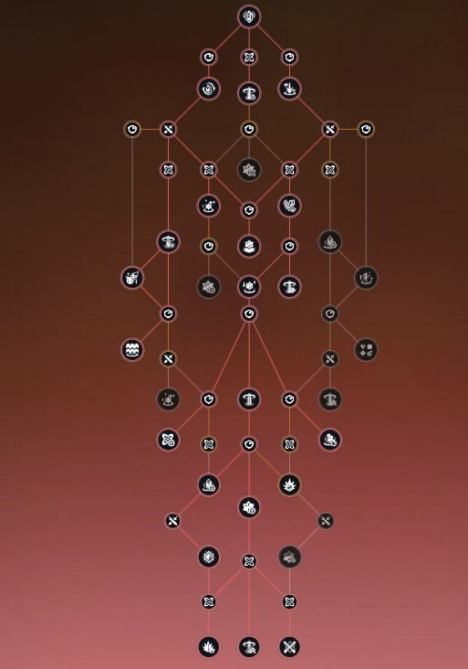

# Season 3 Frostbeam Guide

## General Playstyle

Frost Beam in Season 3 is a stationary frost cannon with limited mobility. To play the class well, a greater focus is needed on understanding the **minimum required movement** to complete raid or dungeon mechanics and burst windows around the mechanics.

Frost Beam is a **burst DPS** class that deals high amounts of damage in a short burst window but frost beam is generally neither great at single target nor AoE damage over a long period of time. It falls behind skyward, falcon and smite in AoE damage. It performs slightly worse than formless and vanguard when mob packs are more spread out / do gather well from maelstrom.

Frost Shock talent node and Fantasia Impact are what you should take for a more AoE oriented build.

---

# Frost Beam Paths

There are currently two primary Frost Beam paths:

1. **Endless Mind Frost Beam** — Faster uptime and more reliant on high Mastery and class skills for damage.
2. **Fantasia Impact Frost Beam** — Less Ice Energy efficiency and more reliant on Luck and lucky procs for damage.

---

# 1. Endless Mind Frost Beam

**Playstyle:** Faster uptime and more reliant on high Mastery and class skills for damage.

Choose **Endless Mind** if you want a more forgiving Frost Beam gameplay experience.

## Recommended Factors

| Factor Type | Recommended |
|---|---|
| **Polarity** | X3, X1 |
| **Inspiration** | X10, X3, X6 |
| **Reality** | X4, X6 |

## Alternative Factors — Non-Stationary Boss

For bosses that require more movement, use the following alternative Factors:

| Factor Type | Alternative |
|---|---|
| **Polarity** | X3, X1 |
| **Inspiration** | X10, X7, X6 |
| **Reality** | X5, X6 |

## Endless Mind Scope Path

Take **everything on the left** except for **Class Stasis**.

This allows you to take the class defensive Factors instead.

## Modules

Recommended priority:

**Life Wave → Damage Stack → Elite Strike = INT → Cast Speed → Crit Focus → Special Attack → Luck Focus**

## Stat Distribution

Target stats **without buffs**:

| Stat | Target |
|---|---:|
| **Haste** | 40% |
| **Luck+** | 40% |
| **Mastery+++** | 40% |
| **Crit** | 15% |

### Stat Priorities

- Obtain **Mastery** and **Haste** naturally from raid set pieces.
- Put all **reforge** and **embeds** into **Luck**.
- For ocean weapon users, magic damage % / luck % / mastery % / 6% mag boost during permafrost
- Obtain the required Crit from **Luck / Crit accessory pieces**.
  - Prioritize **big Luck, small Crit**.
  - each '+' represent one source of flat % stat that you should try to get.
  - for mastery+++, ocean 6%, 4 piece raid effect 10%, life wave 10%
  - for luck +, ocean 6%.

## Imagines

Recommended combination:

**Furball + one of:**

- Predatory Spider
- Muku Chief
- Rorola

There is no significant difference between Predatory Spider, Muku Chief, and Rorola.

**Predatory Spider** provides better burst damage.

---

# 2. Fantasia Impact Frost Beam

**Playstyle:** Less Ice Energy efficiency and more reliant on Luck and lucky procs for damage.

Choose **Fantasia Impact** if you want extra damage, but be aware that your DPS may swing more wildly.

---

## Fantasia Impact — Dungeon Build

### Factors

| Factor Type | Recommended |
|---|---|
| **Polarity** | X3, X1 |
| **Inspiration** | X10, X3, X6 |
| **Reality** | X4, X6 |

### Psychoscope

Recommended setup:

1. Reconstruct
2. Multi-phase Strike
3. Class Stasis
4. Ripple of Fate
5. Chrono Elixir

---

## Fantasia Impact — Boss Build

This build is **less forgiving when breaking your rotation**.

### Factors

| Factor Type | Recommended |
|---|---|
| **Polarity** | X3, X1, X6 |
| **Inspiration** | X10, X6 |
| **Reality** | X4, X6 |

### Psychoscope

Recommended setup:

1. Reconstruct
2. Multi-phase Strike
3. Class Stasis
4. Dual
5. Chrono Elixir

---

## Modules

Recommended priority:

**Damage Stack / life wave → Elite Strike = INT → Cast Speed → Crit Focus → Luck Focus**

---

## Stat Distribution

Target stats **without buffs**:

| Stat | Target |
|---|---:|
| **Haste+** | 45% |
| **Luck+** | 40% |
| **Mastery++** | 35% |
| **Crit** | 15% |

### Stat Priorities

- Obtain **Mastery** and **Haste** naturally from raid set pieces.
- Put all **reforge** and **embeds** into **Luck**.
- Obtain the required Crit from **Luck / Crit accessory pieces**.
- For ocean weapon users, magic damage % / luck % / haste % / 6% mag boost during permafrost
- For the **necklace**, aim for **Haste and Crit**.
  - each '+' represent one source of flat % stat that you should try to get.

## Imagines

Recommended combination:

**Furball + one of:**

- Predatory Spider
- Muku Chief
- Rorola

Predatory spider provides the highest parsing damage. Muku chief is about 1-3% behind Predatory spider.
In dungeon contents with lifebind, pred spider is best out of the 3.
For raids where you are fully buffed by both concerto and lifebind, muku chief may outperform predatory spider. (speculation: raid runs have too much variance for this to be reliably tested)
---

# Gear and Talents

---

## Raid Sets

You have 2 choices with Raid Sets. 
- mastery stacking: 4 piece Season 1 + 2 piece of Season 2
- non-mastery stacking builds: 2 piece Season 1 + 4 piece of Season 2

## Talents (boss oriented):

**For high master push, you will want to swap out one of the frozen gale talent nodes for frost shock for more AoE damage.

## Final Notes
Damage difference between endless mind and fantasia is nearly identical with this stat distribution.
For dungeon content with lifebinds, fantasia will outperform endless mind

S3 Frost Beam is a non-meta class. Play if you like the class. This is probably going to become a guide for SEA since NA season 3 is almost over. Oh well.
